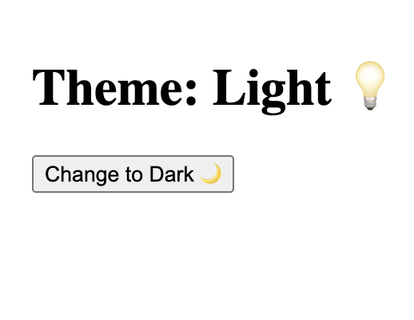
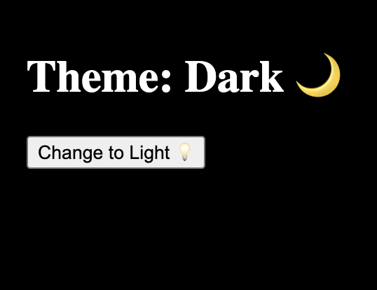

# React Context Theme Toggle

## Description

A React theme toggle project demonstrating the Context API, shared state management, and updating application state from child components.

Users can:
- Switch between light and dark themes.
- See the UI update dynamically based on the current theme.
- Change the theme from a separate child component using Context.

## Features

- Global theme state management using React Context.
- Light and dark theme switching.
- Child component updates parent state through Context.
- Dynamic background and text color changes.
- Dynamic button label based on the current theme.
- Full viewport theme layout.

## Concepts Practiced

- useState
- createContext
- Context Provider
- useContext
- Passing state through Context
- Passing functions through Context
- Updating parent state from child components
- Conditional rendering
- Conditional styling
- Component communication
- State ownership and data flow

## Technologies

- React
- JavaScript (ES6+)
- CSS
- Vite

## Screenshots

### Light theme

### Dark theme

## What I Learned

- How React Context allows components to share data without prop drilling.
- How to create and provide shared values using Context Provider.
- How child components can access shared data using useContext.
- How to pass functions through Context to allow child components to trigger state updates.
- How to keep state and application logic in the correct component.
- How UI changes automatically when state updates.
- How to separate responsibilities between components.

## Theme Logic

- The App component owns the theme state.
- The toggleTheme function handles switching between light and dark themes.
- ThemeContext provides the theme value and toggle function to child components.
- ThemeButton consumes the Context and triggers theme changes.

## Project Structure

- `App.jsx` — manages theme state and provides Context.
- `ThemeContext.js` — creates the shared Context.
- `ThemeButton.jsx` — consumes Context and changes the theme.