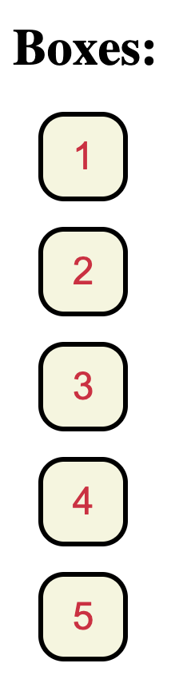

# Number Boxes

A small React project that uses JavaScript’s `.map()` method to render numbered boxes dynamically.

## Screenshot



## Concepts Practised

- Rendering lists with `.map()`
- Creating JSX dynamically from array data
- Adding stable React `key` values
- Styling elements with CSS
- Separating React components

## How It Works

The component maps over an array of numbers and renders one box for every number.

```text
Numbers array → .map() → React elements