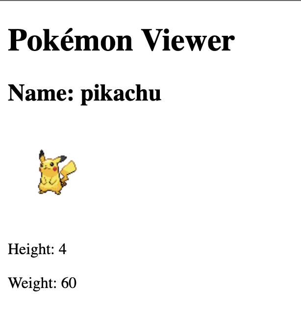

# Pokémon API Viewer

## Description

A React data-fetching project demonstrating how to retrieve Pokémon information from a third-party API and display the received data.

Users can:

- View information about Pikachu retrieved from PokéAPI.
- See the Pokémon's name, image, height, and weight.
- See a loading message while the data is being fetched.

## Features

- Fetches Pokémon data from PokéAPI.
- Displays the Pokémon's name, image, height, and weight.
- Shows a loading message before the data is received.
- Uses conditional rendering based on the current state.
- Displays a Pokémon image from an external URL.

## Concepts Practiced

- `useState`
- `useEffect`
- Fetch API
- Promises
- `.then()`
- `.catch()`
- JSON data
- Saving API data in state
- Reading properties from an API response
- Conditional rendering
- Rendering images from external URLs

## Technologies

- React
- JavaScript (ES6+)
- HTML
- Vite
- PokéAPI

## API Reference

This project uses the free [PokéAPI](https://pokeapi.co/) to retrieve Pokémon data.

### Endpoint

GET https://pokeapi.co/api/v2/pokemon/pikachu

### Data Used

The application reads the following properties from the API response:

- `name` — the Pokémon's name.
- `height` — the Pokémon's height in decimetres.
- `weight` — the Pokémon's weight in hectograms.
- `sprites.front_default` — the URL of the Pokémon's default front image.

No API key or authentication is required.

## Screenshots

### Loaded Pokémon Information

## What I Learned

- How to request data from a third-party API using `fetch()`.
- How to convert an API response into JSON.
- How to save received data in React state.
- How `useEffect` can run a fetch request when a component first renders.
- How React renders again after state is updated.
- How to inspect an API response and find the required properties.
- How to display an image using a URL received from an API.
- How to show a loading message while waiting for data.
- How to conditionally render content based on whether data is available.

## Fetching Logic

- The `pokemon` state initially contains `null`.
- The component initially displays a loading message.
- `useEffect` calls the `getPokemon` function.
- `getPokemon` requests Pikachu data from PokéAPI.
- The response is converted from JSON into a JavaScript object.
- The received object is saved in the `pokemon` state.
- Updating the state causes React to render the component again.
- The Pokémon information appears after the data becomes available.

## Project Structure

01-pokemon-viewer/
├── screenshots/
│   └── screenshot-1.png
├── src/
│   ├── App.jsx
│   └── main.jsx
├── index.html
├── package.json
└── README.md

- `src/App.jsx` — fetches the Pokémon data, stores it in state, and renders the loading or Pokémon information.
- `screenshots/screenshot-1.png` — shows the loaded Pokémon information.