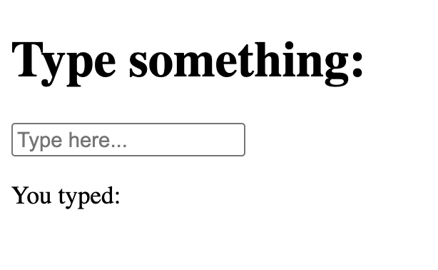
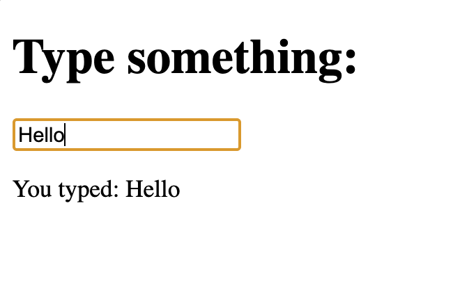

# One Controlled Input

## Description

A simple React project demonstrating a controlled input using `useState`.

## Concepts Practiced

- useState
- Controlled components
- `value` prop
- `onChange` event
- Event handling

## Screenshot

# Initial state

# After Typing

## What I Learned

- How React controls an input.
- Why `value` and `onChange` are used together.
- How state updates on every keystroke.