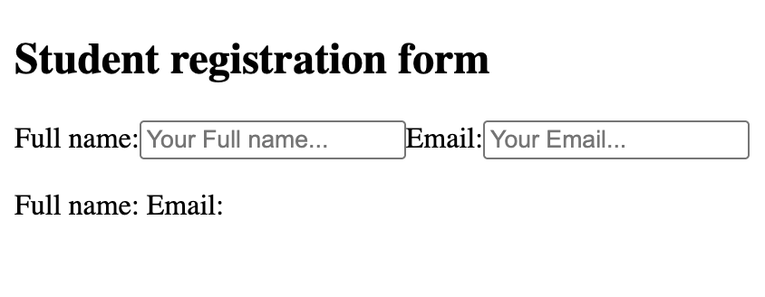
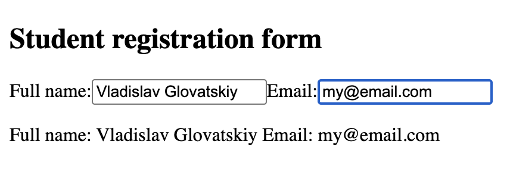

# Two Controlled Inputs

## Description

A simple React project demonstrating multiple controlled inputs using `useState`.

## Technologies

- React
- JavaScript
- Vite
- JSX
- CSS

## Concepts Practiced

- `useState`
- Controlled components
- `value` prop
- `onChange` event
- Event handling
- Multiple state variables
- `htmlFor` and `id` for labels and inputs

## Screenshots

### Initial state

### After typing

## What I Learned

- How to manage multiple controlled inputs in React.
- How each input can have its own state.
- How user input flows through `onChange` into React state.
- How React keeps the input value synchronized with state.