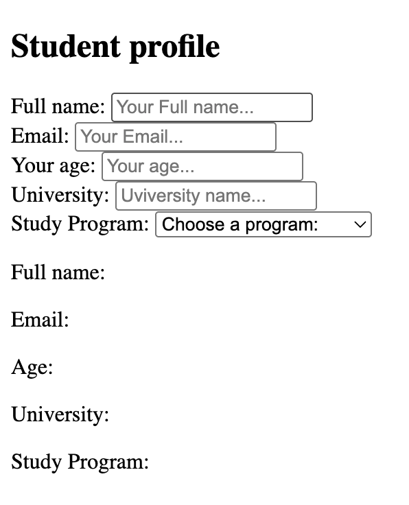
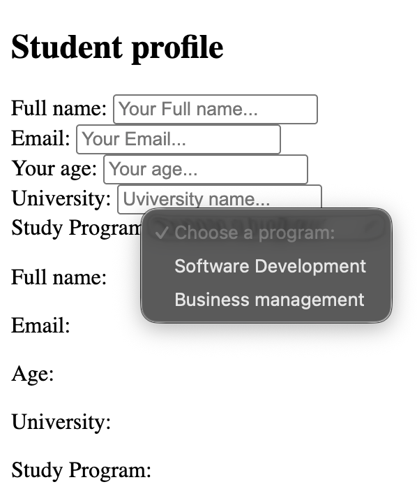
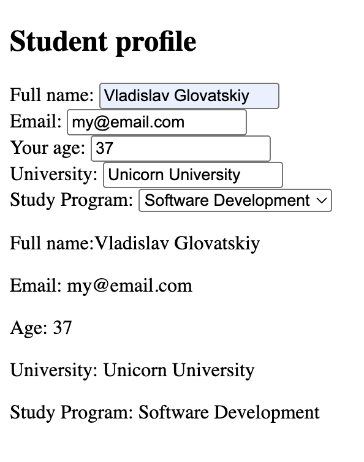

# Student Profile Form

## Description

A simple React project demonstrating how to manage multiple controlled form inputs using a single `formData` state object.

The user can enter student information and select a study program. The entered data is displayed dynamically below the form.

## Features

- Controlled text inputs
- Controlled number input
- Controlled select dropdown
- Single `formData` state object
- Dynamic state updates using input names
- Real-time data preview

## Technologies

- React
- JavaScript (ES6+)
- Vite
- HTML
- CSS

## Concepts Practiced

- `useState` hook
- Controlled components
- Managing multiple inputs with one state object
- `value` and `onChange`
- Event handling
- Dynamic object property updates
- Controlled `<select>` elements

## Screenshots

### Initial State

Empty student profile form.

### Select Dropdown

Study program dropdown with available options.

### Filled Form

Student information entered and displayed from React state.

## What I Learned

- How React controls form inputs through state.
- How to manage multiple fields using one object instead of separate states.
- How `event.target.name` can be used to update the correct field dynamically.
- How controlled dropdowns work in React.
- How UI updates automatically when state changes.