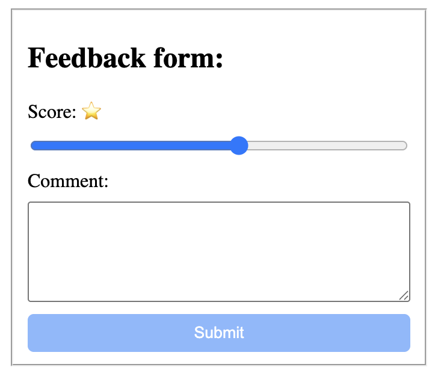
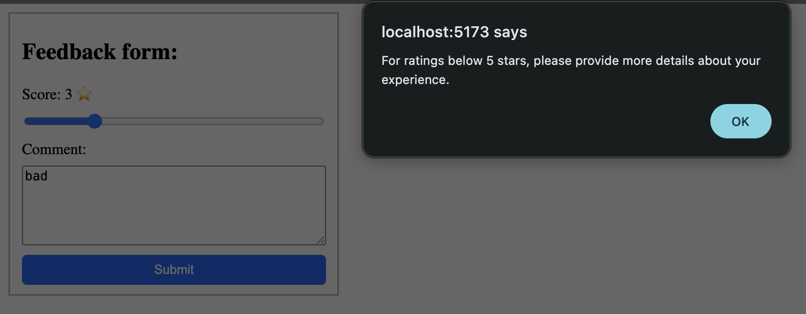
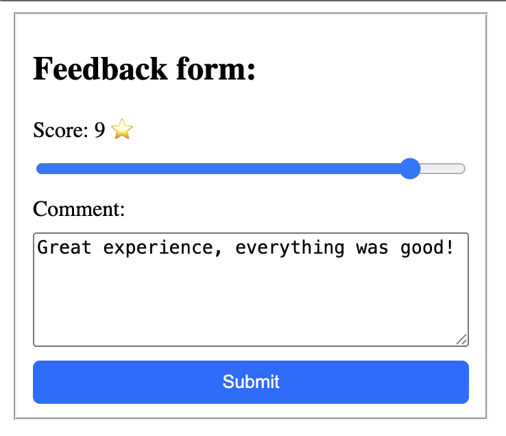

# Feedback Form

## Description

A React feedback form project demonstrating controlled components, form handling, validation, and conditional UI behavior.

Users can:
- Select a rating using a range input.
- Leave additional feedback in a textarea.
- Submit feedback.
- Receive validation feedback when a low rating does not include enough details.

## Features

- Controlled form inputs using React state.
- Submit button disabled until a rating is selected.
- Validation for low ratings.
- Prevents default browser form submission behavior.
- Clears form data after successful submission.

## Concepts Practiced

- useState
- Controlled components
- `value` prop
- `onChange` event
- `onSubmit` event
- `event.preventDefault()`
- Form validation
- Conditional logic
- Disabled button state
- State reset after submission

## Technologies

- React
- JavaScript (ES6+)
- CSS
- Vite

## Screenshots

### Initial state (Submit button disabled)

### Validation for low rating

### Valid feedback (Submit button enabled)

## What I Learned

- How React controls form inputs using state.
- How controlled components work by connecting state with the `value` prop.
- How the `onChange` event updates state when users interact with inputs.
- How to handle form submission using the `onSubmit` event.
- How `event.preventDefault()` prevents the browser's default page refresh behavior.
- How to validate user input before allowing submission.
- How to disable buttons based on application state.
- How to reset controlled inputs by updating React state.

## Validation Logic

- Ratings below 5 require a more detailed comment.
- Comments shorter than 10 characters are rejected for low ratings.
- Valid feedback can be submitted successfully.