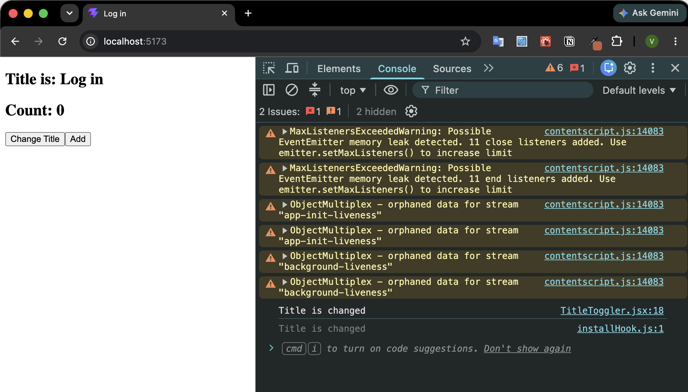
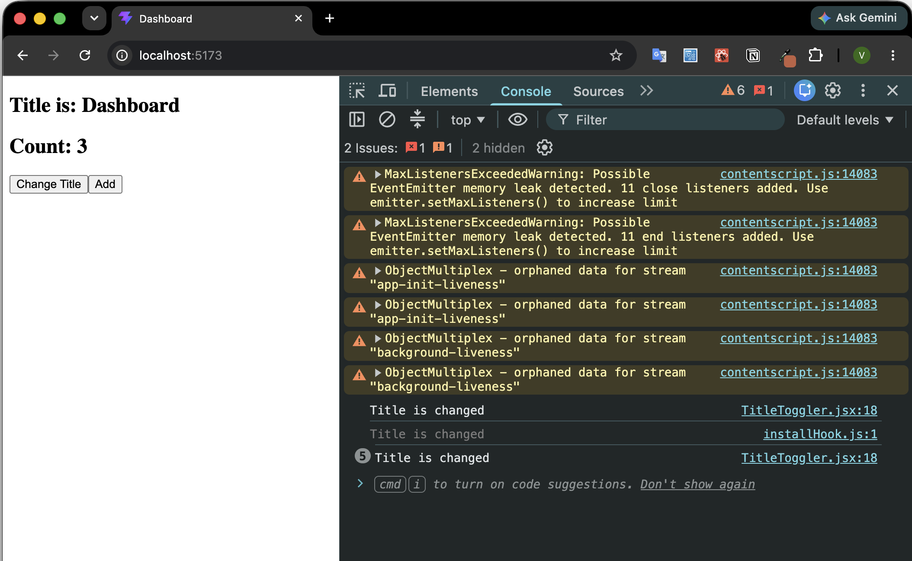

# useEffect - Document Title Toggler

## Overview

This project is a small React practice application created to understand the `useEffect` hook and how React handles side effects.

The main goal was to practice updating data outside the React component by changing the browser tab title using `document.title`.

The project also includes a counter to demonstrate how the `useEffect` dependency array controls when an effect runs.

---

## What I Built

I created a `TitleToggler` component that allows the user to:

- Change the browser tab title between:
  - `Log in`
  - `Dashboard`
- Increase a counter value independently
- Observe in the browser console when the title update effect runs

---

# Screenshots

## Initial State

The application starts with:

- Browser title: `Log in`
- Counter value: `0`



---

## Counter Update Test

After clicking the **Add** button three times:

- Counter value changes to `3`
- Browser title and concole remain unchanged
- Title effect does not run


---

## Title Change Test

After clicking the **Change Title** button:

- Browser title changes from `Log in` to `Dashboard`
- Console shows the effect execution message

```
Title is changed
```

The effect runs because the `toggle` dependency changed.



---

# Key Learning

This project helped me understand:

- How `useState` manages component data
- What side effects are in React
- How `useEffect` works
- How dependency arrays control effect execution
- The difference between state updates and effect execution
- How React prevents unnecessary effect runs