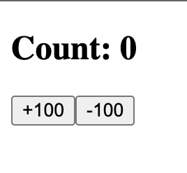
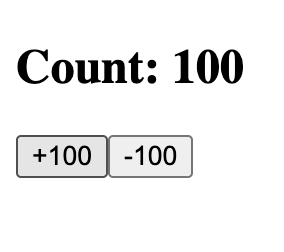
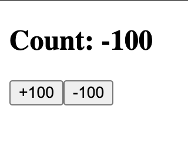

# Counter Using useReducer

## About

A simple React counter created to practise state management with the `useReducer` hook.

The counter can increase or decrease by 100.

## Features

- Increase the count by 100
- Decrease the count by 100
- Display the current count
- Manage state changes using reducer actions

## What I Learned

- How to create a reducer function
- How to initialize state with `useReducer`
- How to dispatch actions
- How the reducer receives the current state and an action
- How the reducer returns the next state
- How React re-renders after the state changes

## Screenshots

### Initial State

### After Increasing

### After Decreasing

## How It Works

When a button is clicked, it dispatches an action. The reducer checks the action type and returns the new count.

- The increase action adds 100
- The decrease action subtracts 100
- Unknown actions return the current state unchanged

## Run the Project

Install dependencies:

npm install

Start the development server:

npm run dev
