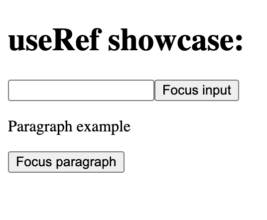
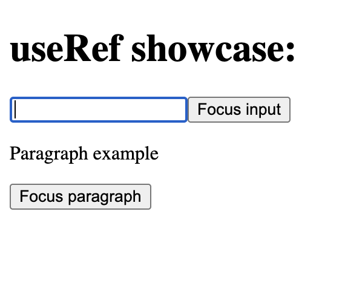
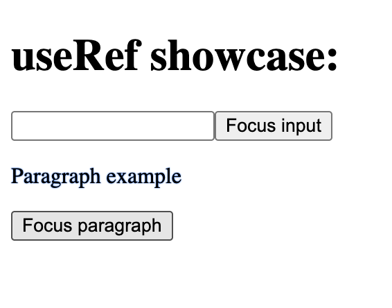

# useRef Focus Showcase

## About

A small React project created to practise accessing and focusing DOM elements with the `useRef` hook.

The project demonstrates how React refs can be attached to different HTML elements and accessed inside event handlers.

## Features

- Focus a text input by clicking a button
- Focus a paragraph by clicking a button
- Apply a visual style when the paragraph receives focus
- Use multiple refs in one component
- Make a normally non-focusable paragraph programmatically focusable

## Concepts Practised

- The `useRef` hook
- Accessing DOM elements with the `current` property
- Calling the DOM `focus` method
- Attaching refs to elements
- Using multiple refs
- Programmatic focus
- The `tabIndex` attribute
- The CSS `:focus` pseudo-class

## How It Works

Each element has its own ref.

When a button is clicked, its event handler accesses the corresponding DOM element through the ref and moves focus to that element.

The paragraph uses a negative `tabIndex`, which allows it to receive focus programmatically without adding it to the normal keyboard Tab order.

## Screenshots

### Initial State

### Input Focused

### Paragraph Focused

## Run the Project

Install dependencies:

npm install

Start the development server:

npm run dev

## What I Learned

- A ref can store a reference to a DOM element
- Updating or accessing a ref does not cause a component re-render
- The `current` property provides access to the referenced element
- Refs are useful for focus management
- Some elements need `tabIndex` before they can receive focus
