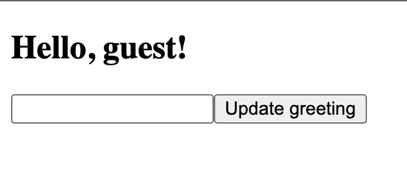
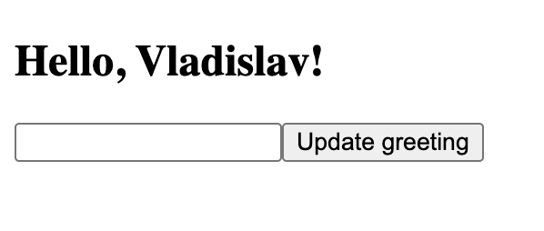

# Dynamic Heading Using useState

## About

A small React project created to practise managing multiple state values with the `useState` hook.

The user can enter a name and click the **Update greeting** button to display a personalized greeting. The input is cleared after the greeting is updated.

## Features

- Display a default guest greeting
- Enter a name using a controlled input
- Update the greeting by clicking a button
- Clear the input after updating the greeting
- Manage the input and displayed name separately
- Use a fallback value when no name has been selected

## Concepts Practised

- The `useState` hook
- Controlled inputs
- Managing multiple state values
- Event handling
- Accessing `event.target.value`
- Updating multiple states in one event handler
- Conditional fallback values
- Re-rendering after state updates

## How It Works

The current input value is stored in the `input` state.

When the user clicks the **Update greeting** button:

1. The current input value is copied into the `name` state.
2. The `input` state is reset to an empty string.
3. React re-renders the component.
4. The heading displays the entered name and the input becomes empty.

If `name` is empty, the `||` operator provides `guest` as the fallback value.

## State Flow

```text
User types a name
→ input state updates
→ user clicks Update greeting
→ name state receives the input value
→ input state is cleared
→ React re-renders the component
```

## Screenshots

### Initial State



### Entered Name



## Run the Project

Install dependencies:

```bash
npm install
```

Start the development server:

```bash
npm run dev
```

## What I Learned

- State values persist between component re-renders
- Controlled inputs receive their value from React state
- Input changes can update state through an event handler
- Separate state values can control input and displayed content
- Multiple state setters can be called inside one event handler
- Resetting controlled-input state clears the visible input
- The `||` operator can provide a fallback display value