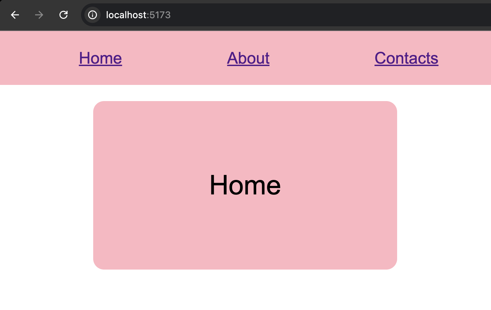
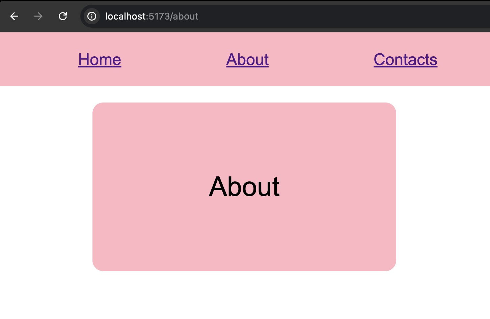
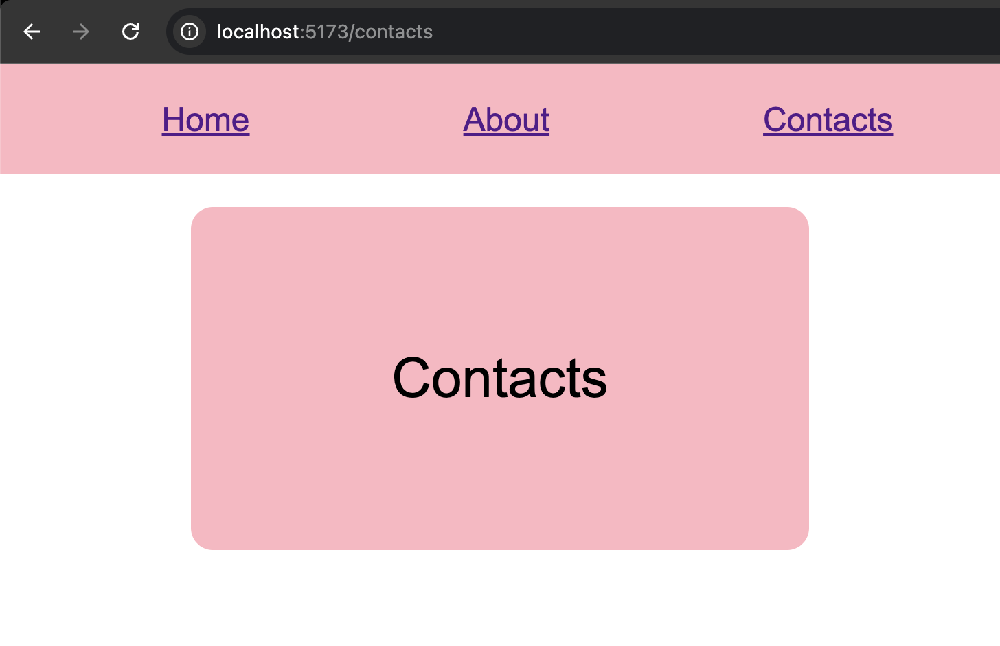

# Simple Navigation

A small React application demonstrating client-side navigation with React Router. Users can navigate between pages without reloading the browser.

## Features

- Home, About and Contacts pages
- Client-side navigation
- Reusable navigation component
- Shared card styling

## Built With

- **React**
- **React Router**
- **Vite**
- **CSS**

## Routes

| Page | URL |
| --- | --- |
| Home | `/` |
| About | `/about` |
| Contacts | `/contacts` |

## Project Structure

```text
src/
├── components/
│   └── Nav.jsx
├── pages/
│   ├── Home.jsx
│   ├── About.jsx
│   └── Contacts.jsx
├── App.css
├── App.jsx
└── main.jsx
```

## Screenshots

### Home



### About



### Contacts



## Getting Started

### Install dependencies

```bash
npm install
```

### Start the development server

```bash
npm run dev
```

## What I Practiced

- Using `BrowserRouter`
- Creating routes with `Routes` and `Route`
- Navigating with `Link`
- Creating reusable components
- Organizing pages and components
- Styling layouts with Flexbox

## Routing Flow

```text
Link clicked
    ↓
URL changes
    ↓
Route matches
    ↓
Page component renders
```
